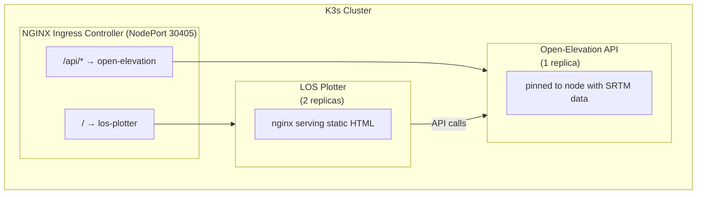

# Line of Sight Plotter

## Overview

An interactive web-based tool for visualising RF (Radio Frequency) line of sight between two geographic points. After exploring various technologies within the HAM/Amateur radio space, I built this to optimise setup for my own node within the [Meshtastic](https://meshtastic.org/)/[Meshcore](https://meshcore.co.uk/) network - also making it open-source to assist others in the mesh community. With this in mind, I have also configured the project for scaling using Kubernetes K3s - featuring an NGINX Ingress Controller for routing and services distributed across nodes (instructions below).

This single-page application combines interactive mapping with elevation profile analysis to determine if a clear signal path exists between two locations. By default it uses a free API for elevation data ([SRTM-250](https://srtm.csi.cgiar.org/srtmdata/)) but custom endpoints can be specified - I serve the [SRTM-30](https://portal.opentopography.org/raster?opentopoID=OTSRTM.082015.4326.1) dataset within my [Homelab](https://github.com/SanabilQureshi#%EF%B8%8F-my-homelab-infrastructure) for added precision and global validity.

The tool displays terrain elevation along the path, calculates the direct line of sight between antennas at configurable heights, and visualises the critical [Fresnel](https://en.wikipedia.org/wiki/Fresnel_zone) zone - helping identify potential obstructions that could degrade signal quality.


#### **Used to help install my own node:**


---

## Key Features

### Core Functionality
- **Interactive Map Interface**: Click-to-place markers on [OpenStreetMap](https://www.openstreetmap.org/#map=6/54.91/-3.43) with draggable repositioning
- **Elevation Profile Generation**: Fetches real terrain data along the signal path with adaptive sampling
- **Line of Sight Calculation**: Computes direct path between two antennas at user-specified heights
- **Fresnel Zone Visualisation**: Displays the 80% first Fresnel zone critical for RF link planning
- **Manual Coordinate Entry**: Direct latitude/longitude input for precise positioning
- **Configurable Elevation API**: Switch between public API, cluster-hosted API, or custom endpoints

### Analysis & Export
- **Terrain Profile Chart**: Interactive [Chart.js](https://www.chartjs.org/) visualisation showing ground elevation vs distance
- **Obstruction Detection**: Visual identification of terrain intersecting the signal path or Fresnel zone
- **PNG Export**: One-click chart export with descriptive filenames including coordinates and antenna heights
- **Distance Calculation**: [Haversine formula](https://en.wikipedia.org/wiki/Haversine_formula) implementation for accurate great-circle distances

---

## Architecture

The application runs entirely client-side (unless hosting a local map data endpoint) as a single HTML file:

```
User Interface
├── Control Panel → Coordinate inputs, antenna heights, action buttons
├── Map View → Leaflet map with draggable markers and path line
└── Chart Panel → Collapsible elevation profile with terrain/LOS/Fresnel

Data Flow
1. User places markers → Coordinates captured
2. Calculate button → API request for elevation samples along path
3. Elevation data → Chart.js renders terrain profile
4. LOS/Fresnel calculated → Overlaid on terrain chart
```

Elevation sampling adapts to path length (100-500 points) to balance detail with API performance. The Fresnel zone calculation uses 868MHz as the reference frequency although this can be changed to 915MHz for the US or any other frequency if WiFi performance (5.8GHz) also needs testing.

---

## Quick Start

### Standalone
No installation or build process required - the application loads all dependencies from CDNs. Simply open the HTML file in any modern browser (Chrome/Firefox).

### Kubernetes Deployment
The application can be deployed to a K8s cluster with an integrated elevation API. See [Kubernetes Deployment](#kubernetes-deployment) for details.

### Usage

1. Click on the map to place Point 1 (green marker)
2. Click again to place Point 2 (red marker)
3. Adjust antenna heights in the control panel (default: 10m)
4. Click "Calculate Line of Sight" to generate the elevation profile
5. Review the chart for terrain obstructions in the signal path
6. Export the chart as PNG for documentation

---

## Chart Interpretation

The elevation profile displays three key elements:

- **Black filled area**: Ground terrain elevation along the path
- **Magenta dashed line**: Direct line of sight between antenna tips
- **Blue shaded region**: 80% first Fresnel zone

For a reliable RF link:
- The line of sight should clear all terrain
- The Fresnel zone should remain unobstructed (ideally 60%+ clearance)
- Terrain penetrating the Fresnel zone indicates potential signal degradation


---

## Implementation Details

- **Coordinate Validation**: Input bounds checking for valid lat/long ranges
- **Adaptive Sampling**: Sample density scales with path length for consistent detail
- **Fallback Data**: Simulated terrain generation if elevation API is unavailable
- **Real-time Updates**: Antenna height changes reflect immediately in marker popups
- **Status Feedback**: Visual indicators for operation progress and errors

---

## Kubernetes Deployment

The project includes manifests for deploying to a [K3s](https://k3s.io/) cluster, bundling the LOS Plotter with a self-hosted [Open-Elevation](https://github.com/Jorl17/open-elevation) API.

### Architecture

````

````

### Components

| Directory | Description |
|-----------|-------------|
| `k8s/` | Kubernetes manifests (namespace, deployments, services, ingress) |
| `Dockerfile` | LOS Plotter container (nginx + static HTML) |
| `open-elevation/` | ARM64-compatible Dockerfile for Open-Elevation |

### Deployment

1. **Cluster Setup** - Install K3s on control plane, disable Traefik (I am using NGINX Ingress):
   
   ```bash
   curl -sfL https://get.k3s.io | INSTALL_K3S_EXEC='--disable traefik' sh -
   ```
   
2. **Join Worker Nodes**:
   ```bash
   curl -sfL https://get.k3s.io | K3S_URL=https://<control-plane>:6443 K3S_TOKEN=<token> sh -
   ```

3. **Install NGINX Ingress Controller**:
   ```bash
   kubectl apply -f https://raw.githubusercontent.com/kubernetes/ingress-nginx/controller-v1.12.2/deploy/static/provider/baremetal/deploy.yaml
   ```

4. **Prepare Elevation Data** - Place SRTM `.tif` files on the node specified in `open-elevation.yaml` nodeSelector.

5. **Deploy Application**:
   
   ```bash
   kubectl apply -f k8s/
   ```
   
6. **Access** - Navigate to `http://<node-ip>:30405` and select "Cluster API (K8s)" for elevation data.

### Docker Images

| Image | Platform | Description |
|-------|----------|-------------|
| `jarkobob/los-plotter:latest` | linux/arm64 | LOS Plotter frontend |
| `jarkobob/open-elevation:arm64` | linux/arm64 | Open-Elevation API |

---

## Future Improvements

- Add support for multiple frequency bands with adjustable Fresnel calculations
- Implement Earth curvature correction for long-distance paths
- Add terrain roughness analysis for diffraction loss estimation
- Support for saving/loading link configurations
- Integration with additional elevation data sources

